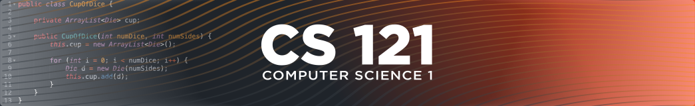

# Module 1 Lab Guide
[Lab Introduction Video](https://boisestate.hosted.panopto.com/Panopto/Pages/Viewer.aspx?id=4e176cd3-ed00-419b-9f26-ae300139dc7a&start=0)  

Please complete the following to setup your local development environment before beginning the programming problems in this lab activity.  
- [Visual Studio Code Intro Videos](https://code.visualstudio.com/docs/getstarted/introvideos)

**NOTE: Please remember to [open the workspace](images/open-lab-workspace.png) before beginning on the lab activities. If you see an error message stating that VSCode Failed to resolve the main method, that the build path is invalid, or that the java file is not on the classpath, you most likely have forgotten to open the workspace correctly.**

## Lab Activity 1 - EmergencyTest
[Walkthrough Video](https://boisestate.hosted.panopto.com/Panopto/Pages/Viewer.aspx?id=bf08a825-afbd-45e1-934f-ae3001409df7&start=0)  
### Problem Description
Enter, compile and run the following application.  

    public class EmergencyTest
    {  
        public static void main(String[] args)
        {
            System.out.println("An Emergency Broadcast");
        }
    }  


### Implementation Guide
1. Expand the folder named A1-EmergencyTest and create a new file named EmergencyTest.java
2. Enter the program code from the Problem Description
3. Run the program using the embedded links above the main method
4. Commit the changes to your local repository with a message stating that Activity 1 is completed.
5. Push the changes from your local repository to the github classroom repository.


## Lab Activity 2 - BugSquasher
[Walkthrough Video](https://boisestate.hosted.panopto.com/Panopto/Pages/Viewer.aspx?id=adda7542-b371-466a-a33b-ae3001431795&start=0)  
### Problem Description
Introduce the following errors, one at a time, into the program from Activity 1.  Record any error messages that the compiler produces.  Fix the previous error each time, before you introduce a new one.  If no error messages are produced, explain why.  Try to predict what will happen before you make each change.
- change *EmergencyTest* to *Test*
- change *Broadcast* to *broadcast*
- remove the first quotation makr in the string
- remove the last quotation mark in the string
- change *main* to *man*
- change *println* to *bogus*
- remove the semicolon at the end of the *println* statement
- remove the last brace in the program
### Implementation Guide
1. Copy EmergencyTest.java from A1-EmergencyTest to A2-BugSquasher
2. Create a new file named Results.md in the A2-BugSquasher folder.
3. Work through each test cases in the Problem Description and document the results in results.md.  This file should be formatted using Markdown notation. You can find a reference at the bottom of this guide.
4. Commit the changes to your local repository with a message stating that Activity 2 is completed.
5. Push the changes from your local repository to the github classroom repository.

## Lab Activity 3 - PersonalBio
[Walkthrough Video](https://boisestate.hosted.panopto.com/Panopto/Pages/Viewer.aspx?id=1f184347-fa20-498f-9359-ae3001468ed0&start=0)  
### Problem Description
Write an application that prints, on separate lines, your name, your birthday, your hobbies, your favorite book, and your favorite movie.  Label each piece of information in the output.

#### Sample Output:  

```
Name: Luke Hindman
Birthday: December 22, 1980
Hobbies:  Mountain Biking, Ham Radio, Reading
Favorite Book: How can I choose?
Favorite Movie:  Hackers
```
### Impementation Guide
1. Expand the folder named A3-PersonalBio and create a new file named PersonalBio.java
2. Design a program to satisfy the requirements in the Problem Description and enter the program code in PersonalBio.java
3. Test the program using the run link above the main method
4. Commit the changes to your local repository with a message stating that Activity 3 is completed.
5. Push the changes from your local repository to the github classroom repository.  

## Markdown Resources
Markdown is a notation that is used to format text documents.  It is widely used in Software Development shops around the world, which is why we're asking you to use it in your lab documentation.  

Github provides a guide for getting started:  [Mastering Markdown](https://guides.github.com/features/mastering-markdown/)
